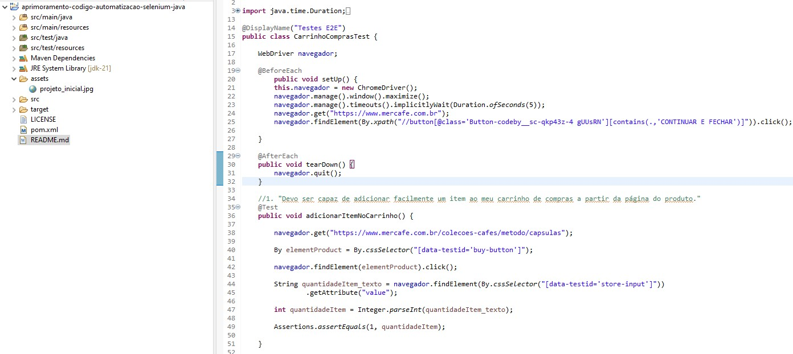

# Feature/automacao-carrinho-compras

Implementação da checagem automatizada da funcionalidade do carrinho de compras.

## Linguagens e Estruturas

- **Java:** Linguagem de programação utilizada.

- **Selenium:** Estrutura de automação do navegador web.

- **JUnit Jupiter:** Estrutura base para os testes.

- **Maven:** Gerenciador de dependências, responsável pela gestão das versões do compilador Java e executor dos testes.


## Pre-requisitos

Antes de executar os testes automatizados neste projeto, certifique-se de que as dependências estejam instaladas e corretamente configuradas: 

- [Java 21](https://www.oracle.com/br/java/technologies/downloads/#java21)
 
- [Maven](https://maven.apache.org/guides/getting-started/maven-in-five-minutes.html)

- [Google Chrome](https://support.google.com/chrome/answer/95346?hl=pt)

## Arquitetura de teste

A arquitetura inicial é simplória, sem padrão de projeto ou boas práticas de codificação.

**Tipo de execução** 

- Local.

**Ambiente de execução**

- Google Chrome


## Atualizações

**Arquivo pom.xml**

O arquivo pom.xml é essencial para o projeto, pois contém configurações importantes. Aqui estão alguns detalhes:

- **\<properties>:** Define as propriedades do projeto que podem ser referenciadas em outras partes do arquivo.

	- **\<project.build.sourceEncoding>:**	Define a codificação de origem do projeto como UTF-8. Isso é útil para garantir que o código-fonte, que pode conter caracteres especiais, seja interpretado corretamente.

```text
	<!-- Definição de propriedades -->
	<properties>
		<project.build.sourceEncoding>UTF-8</project.build.sourceEncoding>
		<java.version>21</java.version>
		<junit.jupiter.version>5.10.1</junit.jupiter.version>
		<selenium.version>4.15.0</selenium.version>
		<!-- Configuração do compilador -->
		<maven.compiler.source>${java.version}</maven.compiler.source>
		<maven.compiler.target>${java.version}</maven.compiler.target>
	</properties>
```

- **\<dependencies>:** São bibliotecas ou frameworks que o seu projeto precisa para compilar e/ou ser executado.

```text
<dependencies>

		<!-- https://mvnrepository.com/artifact/org.junit.jupiter/junit-jupiter-engine -->
		<dependency>
			<groupId>org.junit.jupiter</groupId>
			<artifactId>junit-jupiter</artifactId>
			<version>${junit.jupiter.version}</version>
			<scope>test</scope>
		</dependency>

		<!-- https://mvnrepository.com/artifact/org.seleniumhq.selenium/selenium-java -->
		<dependency>
			<groupId>org.seleniumhq.selenium</groupId>
			<artifactId>selenium-java</artifactId>
			<version>${selenium.version}</version>
		</dependency>
		
	</dependencies>
```

- **maven-compiler-plugin:** Especifica as versões do código Java.

	- **\<source>** Especifica a versão do Java usada para escrever o código-fonte.  

	- **\<target>** Especifica a versão do bytecode Java gerado pelo compilador

```text
<build>
		<plugins>
			<plugin>
				<groupId>org.apache.maven.plugins</groupId>
				<artifactId>maven-compiler-plugin</artifactId>
				<version>3.8.1</version>
				<configuration>
					<source>${maven.compiler.source}</source>
					<target>${maven.compiler.target}</target>
				</configuration>
			</plugin>
		</plugins>
	</build>
```

**Arquivo de Test** 

- O [Junit](https://junit.org/junit5/docs/current/user-guide/)  é uma poderosa estrutura para gerenciamento de testes em Java, proporcionando uma abordagem estruturada para a execução e organização de testes automatizados.

Exemplo de uso:

**@DisplayName:** Declara um nome de exibição personalizado para a classe de teste ou método de teste.

**@Test:** Denota que um método é um método de teste. 

**@BeforeEach: **Denota que o método anotado deve ser executado antes de cada método @Test

**@AfterEach: **Denota que o método anotado deve ser executado após cada @Test método




- O [Selenium WebDriver](https://www.selenium.dev/documentation/webdriver/) aciona um navegador nativamente, como um usuário faria.

Exemplos de comandos Selenium WebDriver:

```java
// Inicializa um novo navegador Chrome.
WebDriver navegador = new ChromeDriver(); 

// Maximiza a janela do navegador.
navegador.manage().window().maximize();

// Define um tempo de espera implícito.
navegador.manage().timeouts().implicitlyWait(Duration.ofSeconds(5)));

// Navega até a URL especificada.
navegador.get("https://www.exemplo.com");

// Localiza e clica em um elemento usando seu ID.
navegador.findElement(By.id("elementoID"))

// Encerra a instância do navegador após a conclusão dos testes.
navegador.quit()

// Verifica se dois valores são iguais.
Assertions.assertEquals(expected, actual) 

// Verifica se a condição fornecida é verdadeira.
Assertions.assertTrue(condition) 
```

## Execução

### Instruções 
Para executar os testes automatizados, siga as etapas abaixo:


1. *Abra um console ou terminal:*
   - No Windows, você pode pressionar `Win + R`, digitar `cmd` ou `powershell`, e pressionar Enter.
   - No Linux ou macOS, você pode usar o terminal padrão do sistema.
  
2. *Navegue até o diretório do projeto:*
```bash
   cd caminho/do/seu/projeto
```

3. *Executar os testes:*
```bash
   mvn test
```

> :warning: **Observações**
> Se estiver utilizando uma IDE, como o IntelliJ ou Eclipse, você também pode executar os testes diretamente na IDE.  
> Certifique-se de que a configuração do ambiente e as dependências estejam configuradas corretamente na IDE.


### Resultados dos Testes

Os resultados do teste apresentaram um cenário indeterminado ao longo de 12 repetições das execuções.

**Resumo Geral dos Testes**

Teste                                | 1 | 2 | 3 | 4 | 5 | 6 | 7 | 8 | 9 | 10 | 11 | 12 |   
-------------------------------------|---|---|---|---|---|---|---|---|---|----|----|----|
adicionarItemNoCarrinho              | 0 | 0 | 0 | 0 | 1 | 0 | 0 | 0 | 1 | 0  | 0  | 0  |
editarQuantidadeDeItensNoCarrinho    | 0 | 0 | 0 | 0 | 0 | 0 | 0 | 1 | 0 | 0  | 0  | 0  |
removerItemNoCarrinho                | 0 | 0 | 0 | 0 | 0 | 0 | 0 | 0 | 0 | 0  | 1  | 1  |
fazerCheckout                        | 0 | 1 | 0 | 0 | 1 | 0 | 0 | 0 | 0 | 0  | 0  | 1  |  
-------------------------------------|---|---|---|---|---|---|---|---|---|----|----|----|
Erros                                | 4 | 3 | 4 | 4 | 2 | 4 | 4 | 3 | 3 | 4  | 3  | 2  |
Sucessos                             | 0 | 1 | 0 | 0 | 2 | 0 | 0 | 1 | 1 | 0  | 1  | 2  |


ERROS                                | 1 | 2 | 3 | 4 | 5 | 6 | 7 | 8 | 9 | 10 | 11 | 12 |
-------------------------------------|---|---|---|---|---|---|---|---|---|----|----|----|
StaleElementReferenceException       | 4 | 3 | 4 | 4 | 2 | 4 | 4 | 3 | 3 | 4  | 3  | 2  |

A presença de StaleElementReferenceException tounou o sistema instável devido a instabilidade nos elementos da interface do usuário durante a execução dos testes automatizados.  
Esta inconsistência pode ser resultado de alterações dinâmicas na página, tempo de espera insuficiente ou outros fatores relacionados à interação com os elementos da interface.
